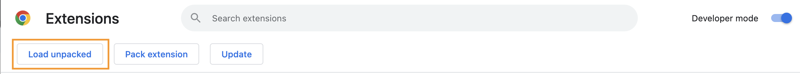
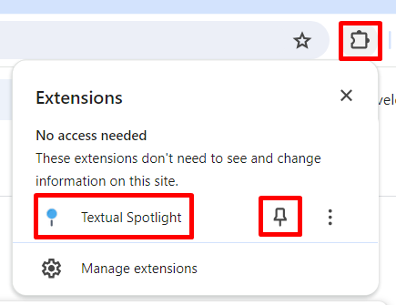
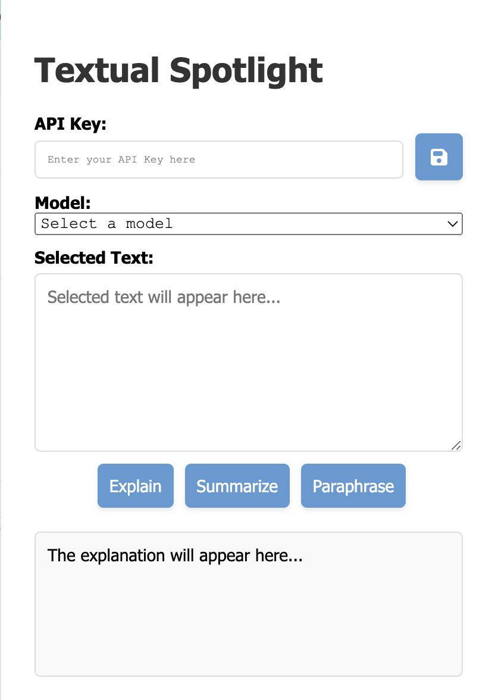
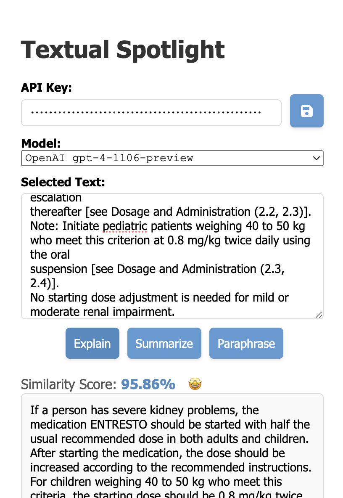

# Textual Spotlight — CS410 Fall 2023 Final Project

## Project Documents

### Project Proposal

- [Click here to view the Project Proposal PDF](./docs/CS410_Final_Project_Proposal.pdf)
- [Click here to view the Project Proposal in Markdown](./docs/CS410_Final_Project_Proposal.md)

### Project Reports

- [Click here to view the Project Progress Report PDF](./docs/%20CS410_Final_Project_Progress_Report.pdf)

---

## Documentation Content

1. [Overview](#overview)
2. [Installation](#installation)
3. [Backend](#backend)
4. [Accessing and Using the Extension](#accessing-and-using-the-extension)
5. [Understanding Text Embeddings and Cosine Similarity](#understanding-text-embeddings-and-cosine-similarity)
6. [Video Demonstration](#video-demonstration)
7. [Testing](#testing)
8. [Future Improvements](#future-improvements)
9. [Team Contributions](#team-contributions)

## Overview
**Textual Spotlight** is a Chrome extension that allows users to highlight specific text in a website and provides explanations, summaries, or paraphrases of the selected text via a seamless browser integration from multiple LLM models with the ability to compare the semantics of the generated result (using Cosine Similarity) and how closely it is related to the user query.

## Installation

### Extension
**Prerequisites**: A Chromium-based web browser with support for Chrome extensions and activation of Developer Mode.

**Step 1**: Download the latest version of the Textual Spotlight extension from the [Releases section](https://github.com/gutyoh/CS410-Final-Project/releases) on GitHub.

**Step 2**: Extract the downloaded ZIP file, which will create a folder containing the extension files.

**Step 3**: Open the Chrome extensions page by navigating to `chrome://extensions/` in your browser, click the toggle in the top right corner to enable *Developer Mode*, next click on *Load unpacked* and select the extracted folder `TextualSpotlight_v1.0.0` to install the extension.

**Step 4**: Once the extension is loaded, enter the API key for your LLM provider of choice. Supported providers include:
- [platform.openai.com](https://platform.openai.com/)
- [dashboard.cohere.com](https://dashboard.cohere.com/)
- [replicate.com](https://replicate.com/)

### ⚠️ API Keys for UIUC Students and TAs ⚠️ 
> ⚠️ **IMPORTANT:** UIUC students and TAs can access the LLM API keys for testing purposes through this [Google Doc link](https://docs.google.com/document/d/1QzvDIUdzJW5X7lvMDRaL5v2ea8sBQcaBYnsVO9A5u58/edit?usp=sharing). 
>
> Please note that you must have an @illinois.edu email address to access this document!

## Backend
Textual Spotlight leverages the [**IntelliServer**](https://github.com/intelligentnode/IntelliServer) — an open-source Node.js middleware, for seamless communication with various AI models. Hosted on Vercel, IntelliServer provides a unified interface for accessing a wide range of AI functionalities, including chatbot interactions, text embeddings, and more, without requiring local setup or installation.

### How Textual Spotlight Uses IntelliServer
- **Unified AI Model Access:** Textual Spotlight uses IntelliServer to connect to different AI models, such as OpenAI, Cohere, and Replicate; this enables users to choose their preferred model for text processing tasks like explanation, summarization, and paraphrasing.

- **Request Management:** The `popup.js` script in Textual Spotlight uses the [`callAIModel()` function](https://github.com/gutyoh/CS410-Final-Project/blob/52f2e0b8895d82ed8d35fc6e208ab69feb778401/extension/popup.js#L84-L127) to manage user interactions, sending requests to IntelliServer's endpoints with selected text and the specified action.

- **Processing Responses:** IntelliServer processes these requests and returns the AI-generated text, which is then displayed within the Chrome extension's UI.

- **Embeddings for Enhanced Analysis:** Textual Spotlight utilizes IntelliServer's capability to generate text embeddings. This feature is crucial for comparing the semantic similarity between the original text and the AI-generated response, adding a layer of advanced text analysis to the extension.

IntelliServer is an integral backend component for Textual Spotlight, offering robust, scalable AI processing capabilities with minimal overhead and no need for local installation.

For more insights into IntelliServer's capabilities and services, visit their [GitHub repository](https://github.com/intelligentnode/IntelliServer).

## Accessing and Using the Extension
After successfully installing the Textual Spotlight extension, you can start using it by following these steps:

1. **Open the Extensions Menu:** Click on the jigsaw puzzle 🧩 icon in the upper right corner of your Chrome browser to access your installed extensions:

2. **Find Textual Spotlight:** Locate and click on the Textual Spotlight extension, marked with a magnifying glass 🔍 icon:

After completing the above steps, click on the extension in the Chrome toolbar and should see the below popup:

### Using Textual Spotlight
Once the Textual Spotlight popup is open, you can interact with it as follows:

1. **Go to a Web Page:** Visit any website where you wish to analyze text.

2. **Highlight Text:** Select a specific paragraph or text segment on the web page by clicking and dragging your mouse.

3. **Enter API Key:** In the extension popup, enter the API Key for the LLM provider you are using (OpenAI, Cohere, or Replicate). 
   > **⚠️ IMPORTANT:** UIUC students and TAs can access the LLM API keys for testing purposes through this [Google Doc link](https://docs.google.com/document/d/1QzvDIUdzJW5X7lvMDRaL5v2ea8sBQcaBYnsVO9A5u58/edit?usp=sharing). 

4. **Choose a Function:** Click one of the buttons within the popup to process the text:
   - **`Explain`**: To get a more detailed but concise explanation of the selected text.
   - **`Summarize`**: For a brief summary of the selected text.
   - **`Paraphrase`**: To have the selected text rephrased in different words.

### Viewing the Results
After processing, the extension will display the output within the popup, as shown in the example below:

## Understanding Text Embeddings and Cosine Similarity

**Text Embeddings** are a form of vector representation where words, phrases, or entire documents are converted into numerical values in a high-dimensional space. In this space, the semantic similarity of texts is represented by their proximity to each other. AI models generate these vectors and capture the contextual essence of the text, going beyond mere keyword matching.

### How do AI Models Generate Text Embeddings?

- **Process**: AI models or LLMs like GPT analyze the text and map its semantic features to a vector. Each dimension of this vector corresponds to a feature learned by the model from large datasets.

- **Appearance**: An embedding is essentially a list of numbers. Consider a simple text phrase like "Hello, world!" an AI model might represent this as an embedding like embedding might look like `[0.23, -1.45, 0.88, ...]`. Each number in this vector represents a different aspect or feature of the text as understood by the model.

- **Functionality**: These embeddings allow the AI models to 'understand' text in mathematical terms, enabling operations like cosine similarity comparison, which would be impossible with raw text.

### Embeddings in Textual Spotlight

- **Embedding Generation**: When a user selects text and an action (explain, summarize, paraphrase), the `popup.js` script sends the original and AI-processed text to IntelliServer, which uses the chosen AI model to generate embeddings for both the original text and the AI-processed text.

- **Cosine Similarity Calculation**: The `matcher.js` script then calculates the cosine similarity between these two sets of embeddings; this metric measures the cosine of the angle between two vectors, providing a value between -1 and 1. A value closer to 1 indicates high similarity.

- **Practical Application**: By calculating this score, Textual Spotlight quantitatively evaluates how closely the AI's response matches the original text's meaning; this is particularly useful in assessing the effectiveness and accuracy of the AI model in understanding and processing the user's request.
 

To sum up, these text embeddings allow Textual Spotlight to quantitatively assess how closely the AI's response aligns with the original text's meaning, providing valuable insights into the effectiveness of different AI models. 

## Video Demonstration

Watch a Video Demo of using the Textual Spotlight Chrome Extension below:

## Testing
- [Click here to view the Project Testing PDF](./docs/CS410_Final_Project_Testing.pdf)

## Future Improvements

- **Integrate additional LLMs**: Expand the range of supported models by incorporating open-source LLMs from Hugging Face and similar platforms.

- **Enhance vector similarity accuracy**: Dedicate a third-party model specifically for vector generation to improve relevance scoring and reduce biases inherent in using the same model for both response generation and vector calculation.

- **Semantic search functionality**: Intended to allow users to
input a query and find semantically related segments in highlighted text using
cosine similarity; this feature is considered a potential enhancement to the main
usage of the extension.

## Team Contributions

#### Hermann Rösch (Team Captain) — hrosch2@illinois.edu
* General Extension design
* Popup UI (HTML & CSS) implementation
* Prompt Engineering/Creation
* Improving the Popup UI after receiving feedback
* Recording and Conducting the Video Demonstration

#### Sudeshna Pal — sp92@illinois.edu
* End-User Testing
* Popup UI Testing
* Prompt Testing
* Improving Prompts and measuring effectivity
* Project Progress Reports

#### Ahmad Albarqawi — ahmada8@illinois.edu 
* Popup JS code Integration with IntelliServer
* Integrating Prompts into the Popup JS code
* Cosine similarity and embedding integration
* Improving the Popup JS code to better handle LLMs responses
* Project Documentation
